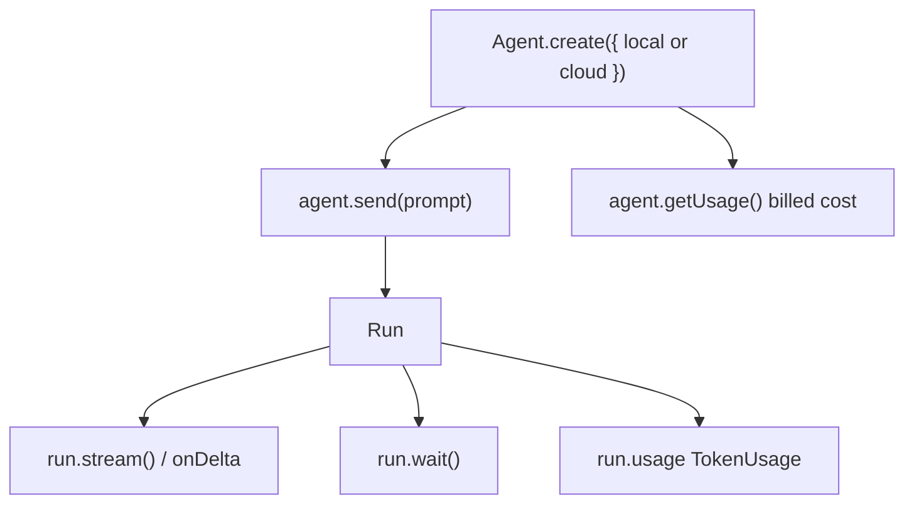

# Concept map - start here

One page. Read it before Lab 1.

The Claude twin's concept map says: everything is one endpoint
(`POST /v1/messages`) and structured outputs, tools, streaming, and cache are
parameters on that request.

That is true of Claude. It is not true of Cursor.

## Agent + Run, not one Messages endpoint with flags



| Concept | What it is |
|---|---|
| **Agent** | Durable container: conversation state, workspace, settings. Survives across prompts. Local ids start with `agent-`. Cloud ids start with `bc-`. |
| **Run** | One prompt submission. Owns stream, status, result, cancel, `requestId`. |
| **SDKMessage** | Normalized stream events. Same shape on local and cloud. |

You write the same TypeScript against local or cloud. Runtime is which key you
pass to `Agent.create()` (`local` or `cloud`). Inference is hosted either way.
"Local" means the agent loop and the files live in this Node process.

Official map:

- APIs overview: [cursor.com/docs/api](https://cursor.com/docs/api)
- TypeScript SDK: [cursor.com/docs/sdk/typescript](https://cursor.com/docs/sdk/typescript)
- Cloud Agents REST: [cursor.com/docs/cloud-agent/api/endpoints](https://cursor.com/docs/cloud-agent/api/endpoints)

The overview says it plainly: the Cloud Agents API and SDKs run agent
workflows (workspace, tools, commands, edits). They are not a standalone
model-inference or chat-completions API.

## Same four product routes, different primitives

| Product route | Claude twin | This repo |
|---|---|---|
| `POST /v1/triage` | `output_config.format` + `messages.parse()` | Prompt asks for JSON; `parseTriageOutput` + Zod in our process |
| `POST /v1/resolve` | `beta.messages.toolRunner` + `max_iterations` | `local.customTools` on a local Agent; cap in our `execute` |
| `POST /v1/draft` | `messages.stream()` SSE | `run.stream()` (or `onDelta` text-delta) as SSE |
| `POST /v1/estimate` | `messages.countTokens()` (free, no inference) | No pre-call count. Report `run.usage` / `getUsage()` after or around a run |
| `GET /v1/limits` | Last response's rate-limit headers | `Cursor.me()` + published rate-limit text |

## What you will not find

- A Cursor Messages or chat-completions endpoint. Do not invent one.
- `cache_control` or a prompt-cache TTL you set. Cache *tokens* still appear
  on `TokenUsage` (`cacheReadTokens`, `cacheWriteTokens`).
- `count_tokens` before a call.
- Custom tools on cloud agents. `local.customTools` throws
  `ConfigurationError` if you pass it to cloud. This slice boots locally.
- A hardcoded model catalog. `Cursor.models.list()` (REST: `GET /v1/models`)
  is the source of truth. Router is `auto-smart` plus `optimize_for` only when
  that pair appears in the catalog for your key.

## Local default for Day 1

```ts
const agent = await Agent.create({
  apiKey: process.env.CURSOR_API_KEY,
  model, // from Cursor.models.list()
  tools: [], // no built-in shell/edit on a support ticket
  local: {
    cwd: process.cwd(),
    customTools, // resolve only; local-only
  },
});

const run = await agent.send(prompt);
```

No-repo cloud agents (`cloud: { repos: [] }`) are a later lab, not required
for this slice to boot.

Continue with [setup.md](setup.md), then [lab-0](labs/lab-0-scoreboard.md).
